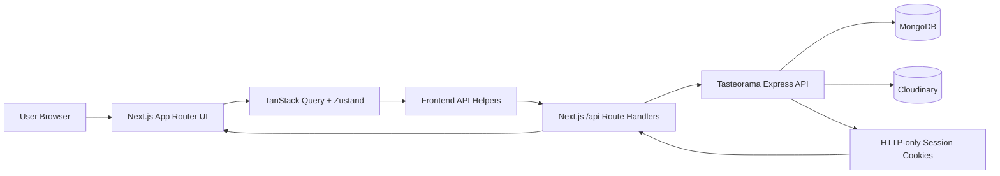

# Tasteorama Frontend

## Project Overview

Tasteorama is a responsive recipe application built with Next.js. The frontend provides a public recipe catalog, recipe details, authentication, favorites, profile recipe lists, and a protected flow for creating new recipes with image upload.

The application communicates with the Tasteorama Express API through Next.js route handlers. Browser-facing code calls the local `/api` layer, while server route handlers forward requests to the backend and manage authentication cookies.

## Features

- Recipe catalog with search, category filters, ingredient filters, and infinite loading
- Recipe details pages with image, description, ingredients, instructions, cooking time, and calories
- User registration, login, logout, and session refresh
- Protected profile area for own recipes and favorite recipes
- Add recipe form with validation, ingredient selection, image preview, and multipart upload
- Save and unsave recipes for authenticated users
- Responsive UI using CSS Modules and shared static assets
- Custom 404, loading, and error states

## Tech Stack

| Area | Technology |
| --- | --- |
| Framework | Next.js 16 App Router |
| UI | React 19, TypeScript |
| Server state | TanStack Query |
| Client state | Zustand |
| API communication | Axios, Fetch, Next.js Route Handlers |
| Forms | Formik, Yup |
| Styling | CSS Modules, modern-normalize |
| Notifications | react-hot-toast |
| Backend | Express 5, MongoDB/Mongoose, cookie sessions |
| Media | Next Image, Cloudinary-hosted uploads |

## Architecture Overview



### Data Flow

- Public recipe, category, and ingredient data is loaded through `/api/recipes`, `/api/categories`, and `/api/ingredients`.
- Search and filter values are stored in URL query parameters and consumed by `useRecipesList`.
- TanStack Query handles recipe list pagination, filter collections, favorites invalidation, and recipe detail ingredient lookups.
- Zustand stores the authenticated user, authentication status, and auth-modal state.

### Authentication Flow

- Registration and login call `/api/auth/register` and `/api/auth/login`.
- Next.js route handlers forward credentials to the backend and copy backend `Set-Cookie` values into the frontend response.
- The backend stores `sessionId`, `accessToken`, and `refreshToken` cookies.
- `AuthProvider` checks `/api/auth/session` on route changes and loads the current user through `/api/auth/me`.
- `proxy.ts` protects `/profile/own`, `/profile/favorites`, `/add-recipe`, and `/logout`, and redirects authenticated users away from auth routes.

## Project Structure

```text
.
├── app/                 # App Router pages, layouts, error states, and /api route handlers
│   ├── api/             # Frontend API proxy routes for auth, recipes, categories, ingredients
│   ├── profile/         # Protected profile recipe views
│   ├── recipes/         # Recipe detail route
│   └── add-recipe/      # Protected recipe creation page
├── components/          # UI components with co-located CSS Modules
├── hooks/               # Client hooks for recipes, favorites, and local search
├── lib/
│   ├── api/             # Axios instance and typed API helpers
│   └── store/           # Zustand auth store
├── public/              # Static images, favicon files, logo, and SVG sprite
├── types/               # Shared TypeScript domain types
├── next.config.ts       # Next Image remote host configuration
└── proxy.ts             # Route protection and auth redirects
```

## Installation

```bash
git clone https://github.com/oleksandr-pitsyk/tasteorama-frontend.git
cd tasteorama-frontend
npm install
npm run dev
```

The development server runs at `http://localhost:3000`.

## Scripts

| Command | Description |
| --- | --- |
| `npm run dev` | Start the Next.js development server |
| `npm run build` | Create a production build |
| `npm run start` | Start the production server |
| `npm run lint` | Run ESLint |

## Environment Variables

Create `.env.local` in the project root:

```env
NEXT_PUBLIC_API_URL=
```

`NEXT_PUBLIC_API_URL` is used by `lib/api/api.ts` to build the frontend API base URL. Leaving it empty makes client helpers call same-origin routes such as `/api/recipes`. For a deployed frontend, set it to the deployed frontend origin if same-origin API routing is required.

The backend repository also defines these server-side variables in `.env.example`:

```env
PORT=3000
MONGO_URL=
NODE_ENV=development
CLOUDINARY_CLOUD_NAME=
CLOUDINARY_API_KEY=
CLOUDINARY_API_SECRET=
```

## API Integration

The frontend exposes a local API facade under `app/api`:

| Frontend route | Backend route |
| --- | --- |
| `/api/auth/register` | `POST /auth/register` |
| `/api/auth/login` | `POST /auth/login` |
| `/api/auth/logout` | `POST /auth/logout` |
| `/api/auth/session` | `GET /auth/refresh` when refresh is needed |
| `/api/auth/me` | `GET /users/me` |
| `/api/categories` | `GET /categories` |
| `/api/ingredients` | `GET /ingredients` |
| `/api/recipes` | `GET /recipes`, `POST /recipes` |
| `/api/recipes/my` | `GET /recipes/my` |
| `/api/recipes/favorites` | `GET /recipes/favorites` |
| `/api/recipes/favorites/[recipeId]` | `POST/DELETE /recipes/favorites/:recipeId` |
| `/api/recipes/[recipeId]` | `GET/DELETE /recipes/:recipeId` |

The backend base URL is currently hardcoded in `app/api/api.ts` as:

```text
https://tasteorama-backend-jumn.onrender.com
```

## Deployment

- The frontend metadata points to `https://tasteorama-frontend.vercel.app/`.
- The backend API is hosted at `https://tasteorama-backend-jumn.onrender.com`.
- No repository-specific deployment config file was found in the frontend repository.
- `next.config.ts` allows remote images from `ftp.goit.study` and `res.cloudinary.com`.

## Future Improvements

- Move the backend base URL from `app/api/api.ts` into an environment variable.
- Add automated tests for authentication, API route handlers, and recipe flows.
- Add an `.env.example` file for the frontend.
- Normalize API response shapes for user objects and recipe creation responses.
- Add CI checks for linting, type checking, and production builds.

## Project Resources

| Resource | Link |
| --- | --- |
| Frontend repository | https://github.com/oleksandr-pitsyk/tasteorama-frontend |
| Backend repository | https://github.com/oleksandr-pitsyk/tasteorama-backend |
| Frontend deployment | https://tasteorama-frontend.vercel.app/ |
| Backend deployment | https://tasteorama-backend-jumn.onrender.com |
| Swagger documentation | https://tasteorama-backend-jumn.onrender.com/api-docs |

## Assumptions

- The frontend production URL is treated as current because it is used in `app/layout.tsx` metadata.
- The backend production URL is treated as current because it is hardcoded in the frontend API proxy.
- The Figma/design URL is not included because no verified URL was found in the codebase.

## Missing Documentation or Configuration

- Frontend `.env.example` is missing.
- Frontend deployment configuration is not present in the repository.
- Backend README contains only a short project title and does not document setup or API usage.
- Test coverage is not configured; the backend `test` script is a placeholder and the frontend has no test script.
